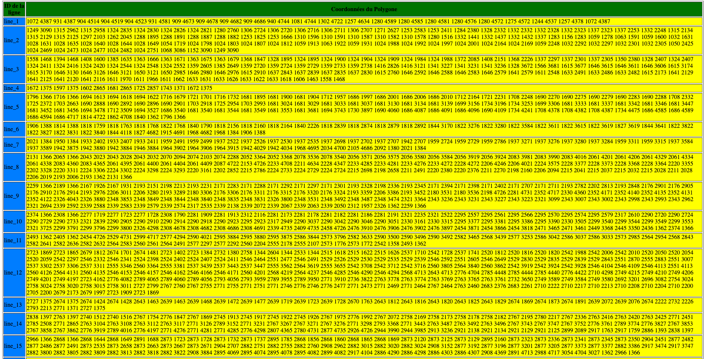

# Segmentation avec Kraken 

Pour segementer une image via Kraken (on utilise la version **4.3.12**): 

``` bash
kraken --alto  -i image.jpg  output.xml segment -bl -i modele.mlmodel
```

Pour segmenter plusieurs images :

``` bash
kraken --alto  -I '*.jpg' -o '*.xml' segment -bl -i modele.mlmodel
```

Segmentation Baseline 
Output = XML Alto 

## Exemple avec une image d'une Stelle 

```bash
kraken --alto  -i 00043.jpg  0043.xml segment -bl -i modele_47.mlmodel
```


## Segmentation de Page dans Kraken

Kraken propose deux méthodes de segmentation de page : la segmentation Baseline et la segmentation Legacy Box.

### Segmentation Baseline
* Utilise un modèle de segmentation pour étiqueter chaque pixel, distinguant les lignes et les régions.
* Modèle par défaut adapté aux documents imprimés et manuscrits sur papier.
* Des modèles personnalisés peuvent être entraînés pour des types de documents spécifiques.
* Activée avec l'option `-bl`.

### Segmentation Legacy Box
* Produit des boîtes rectangulaires dans l'ordre de lecture.
* !! Nécessite des images d'entrée binarisées
* Des paramètres spécifiques sont disponibles pour la personnalisation.

### Direction de Texte Principale
* Cruciale pour déterminer l'ordre des blocs de texte et des lignes `-d/–text-direction`
* Les options incluent `horizontal-lr`, `horizontal-rl``, vertical-lr` et `vertical-rl`.
* Dépend de l'orientation du script et de l'ordre de lecture.

### Masquage
* Permet de bloquer certaines zones de la segmentation en utilisant des images de masque binaires.
* Image de madque a la même taille que l'image + régions que l'on veut guarder sont blanches (noire pour reste)
```bash
kraken -i input.jpg segmentation.json segment -bl -m mask.png
```


# Fichier Alto 

Définition simple : ALTO aide à décrire comment un document est organisé. Cela inclut où les pages commencent et finissent, où se trouvent les lignes de texte, les colonnes, les blocs de texte, les images, et autres éléments graphiques. Cette structuration aide à comprendre le layout ou la mise en page originale du document.

Dans notre cas, alto va nous permettre de localiser les lignes de textes (les polygones) = 
- permet de lire le texte (facilité pour l'OCR)
- de savoir exactement où la ligne est sur la page (ce qui aide à la création d'une version numérique du doc)

Utilisation dans la numérisation de bibliothèques : Les bibliothèques et les archives utilisent le format ALTO pour la numérisation de leurs collections car il aide à préserver les informations sur l'organisation originale des documents tout en fournissant un accès au texte via l'OCR.

Revenons sur l'exemple de l'image que l'on a segmenté, le fichier xml alto produit est structuré de la manière suivante : 

```xml
<?xml version="1.0" encoding="UTF-8"?>
<alto xmlns:xsi="http://www.w3.org/2001/XMLSchema-instance"
      xmlns="http://www.loc.gov/standards/alto/ns-v4#"
      xsi:schemaLocation="http://www.loc.gov/standards/alto/ns-v4# http://www.loc.gov/standards/alto/v4/alto-4-2.xsd">
      
  <Description>
    <MeasurementUnit>pixel</MeasurementUnit>
    <sourceImageInformation>
      <fileName>00043.jpg</fileName>
    </sourceImageInformation>
  </Description>
  
  <Tags>
        <OtherTag ID="TYPE_1" LABEL="default"/>
        <OtherTag ID="TYPE_2" LABEL="text"/>
        <OtherTag ID="TYPE_3" LABEL="Title"/>
        <OtherTag ID="TYPE_4" LABEL="SteleArea"/>
        <OtherTag ID="TYPE_5" LABEL="Commentary"/>
        <OtherTag ID="TYPE_6" LABEL="Numbering"/>
        <OtherTag ID="TYPE_7" LABEL="Intext"/>
  </Tags>
  
  <Layout>
    <Page WIDTH="3840" HEIGHT="4900" PHYSICAL_IMG_NR="0" ID="eSc_dummypage_">
      <PrintSpace HPOS="0" VPOS="0" WIDTH="3840" HEIGHT="4900">
        <TextBlock ID="block_2" HPOS="335" VPOS="176" WIDTH="3434" HEIGHT="5057" TAGREFS="TYPE_4">
          <TextLine ID="eSc_line_2516d9d8" TAGREFS="LT15290" HPOS="1883" VPOS="1351" WIDTH="171" HEIGHT="359">
            <String CONTENT=""/>
          </TextLine>
          <!-- Autres balises TextLine -->
        </TextBlock>
        <!-- Autres balises TextBlock  -->
      </PrintSpace>
    </Page>
  </Layout>
</alto>

```

## Explication des balises principales :

#### `<alto>` 
La balise racine qui définit que le document est au format ALTO. Elle inclut des attributs pour l'espace de noms XML et la localisation du schéma XSD qui valide le format du document.

#### `<Description>`

`<MeasurementUnit>` : Définit l'unité de mesure utilisée dans le document, généralement des pixels pour les images numérisées.

`<sourceImageInformation>` : Contient des informations sur l'image source, y compris le nom du fichier de l'image qui a été traitée par OCR.

#### `<Tags>`

`<OtherTag>` : Utilisée pour définir des types de contenu spécifiques comme les titres, les illustrations, etc. Chaque tag peut être référencé plus tard dans le document pour marquer différents types de blocs ou de lignes.

#### `<Layout>`

`<Page>` : Représente une page du document numérisé, avec des attributs pour les dimensions et un identifiant unique.

`<PrintSpace>` : Définit l'espace imprimable de la page où le contenu peut être placé.

#### `<TextBlock>`

Spécifie un bloc de texte dans l'espace imprimable. Contient des coordonnées, dimensions, et peut-être référencé à un type spécifique défini dans `<Tags>`. Ici, le TextBlock correspond à la zone de la Stele (SteleArea). Il comprend un polygone individuel qui enrobe toute la stele, et plusieurs TextLines qui correspondent aux différentes lignes de texte. 

#### `<TextLine>`
Représente une ligne de texte individuelle dans un bloc de texte. Elle inclut aussi des coordonnées et des dimensions.

#### `<String>`
Contient le texte réel extrait par OCR pour une ligne donnée, avec ses propres coordonnées et dimensions pour permettre un positionnement précis.

# Fichier METS

Format de fichier utilisé pour coder les métadonnées descriptives, administratives et structurelles concernant un objet numérique

```xml
<mets xmlns="http://www.loc.gov/METS/" xmlns:xlink="http://www.w3.org/1999/xlink">

    <!-- Section des fichiers où tous les fichiers numériques associés à l'objet sont listés. -->
  <fileSec>

    <!-- Utilisé pour organiser les fichiers en catégories selon leur usage -->
    <fileGrp USE="image">
        
      <!-- Détaille un fichier individuel au sein d'un groupe de fichiers. -->
      <file ID="image1">
        <FLocat xlink:href="00043.jpg"/>
      </file>
    </fileGrp>

    <fileGrp USE="export">
      <file ID="export1">
        <FLocat xlink:href="00043.xml"/>
      </file>
    </fileGrp>
  </fileSec>

  <!-- Carte structurelle, décrit la structure physique et/ou logique de l'objet numérique.-->
  <structMap TYPE="physical">
  
    <!-- Division dans la carte structurelle, peut représenter des niveaux de structure comme un document, une page, un chapitre -->
    <div TYPE="document">
      <div TYPE="page">
        <fptr FILEID="image1"/>
        <fptr FILEID="export1"/>
      </div>
    </div>

  </structMap>
</mets>
```

***En Bref : Alto va permettre de structurer notre image (coordonnées des différentes régions, et inclut le contenu après OCR). C'est l'étiquette qu'on va utiliser pour entrainer notre modèle. Le fichier METS quant à lui permet de structuré les métadonnées de notre images (lié le code xml alto à l'image en question).***

# Opérations sur le fichier XML Alto 

On a récupérer le fichier XML de segmentation. On peut maintenant effectuer des opérations sur ces données. 

XPath nous permet de naviguer notre fichier xml. Revenons sur notre fichier xml alto : 

```xml 
<Layout>
    <Page WIDTH="3840" HEIGHT="4900" PHYSICAL_IMG_NR="0" ID="eSc_dummypage_">
      <PrintSpace HPOS="0" VPOS="0" WIDTH="3840" HEIGHT="4900">
        <TextBlock ID="block_2" HPOS="335" VPOS="176" WIDTH="3434" HEIGHT="5057" TAGREFS="TYPE_4">
          <!-- Shape = Polygone qui enrobe la stelle en entière -->
          <Shape>
              <Polygon POINTS="820 176 3363 176 3592 317 3734 899 3734 1141 3628 1199 3628 1318 3751 1358 3751 1900 3632 1794 3610 2023 3628 2288 3681 2310 3734 2222 3751 2292 3769 5198 2025 5233 335 5180 353 458 476 299 820 176"/>
          </Shape>
          <TextLine ID="eSc_line_2516d9d8" TAGREFS="LT15290" HPOS="1883" VPOS="1351" WIDTH="171" HEIGHT="359">
            <!-- Shape qui entoure une ligne -->
            <Shape>
              <Polygon POINTS="820 176 3363 176 3592 317 3734 899 3734 1141 3628 1199 3628 1318 3751 1358 3751 1900 3632 1794 3610 2023 3628 2288 3681 2310 3734 2222 3751 2292 3769 5198 2025 5233 335 5180 353 458 476 299 820 176"/>
            </Shape>
            <String CONTENT=""/>
          </TextLine>
          <!-- Autres balises TextLine -->
        </TextBlock>
        <!-- Autres balises TextBlock  -->
      </PrintSpace>
    </Page>
  </Layout>
```

On observe que l'on a deux types de noeud `Shape`, un qui est enfant direct du `TextBlock` et l'autre qui enfant de la balise `Textline`. 

Ce qui nous intéresse, c'est le second. Comment le récupérer ? 

```XML
alto:TextBlock/alto:TextLine/alto:Shape/alto:Polygon/@POINTS
```

**XPATH permet de viser les données que l'on veut dans un fichier XML**

Ok, on a récupéré nos données maintenant, disons que j'aimerais pouvoir voir le nombre de lignes de texte que j'ai et les coordonnées de chaque : pour ce faire, on utilisera un fichier XSLT : 

```xml
<?xml version="1.0" encoding="UTF-8"?>
<xsl:stylesheet version="1.0" xmlns:xsl="http://www.w3.org/1999/XSL/Transform"
    xmlns="http://www.w3.org/1999/xhtml"
    xmlns:alto="http://www.loc.gov/standards/alto/ns-v4#">
    <xsl:output method="html" indent="yes" />
    <xsl:template match="/">
        <html>
            <head>
                <title>Test</title>
            </head>
            <body>
                <table border="1">
                    <tr>
                        <th>ID de la ligne</th>
                        <th>Coordonnées du Polygone</th>
                    </tr>
                    <xsl:for-each select="//alto:TextLine">
                        <tr>
                            <td>
                                <xsl:value-of select="@ID" />
                            </td>
                            <td>
                                <xsl:value-of select="alto:Shape/alto:Polygon/@POINTS" />
                            </td>
                        </tr>
                    </xsl:for-each>
                </table>
            </body>
        </html>
    </xsl:template>
</xsl:stylesheet>
```

On créer ici un tableau et récupère les données de chaque `TextLine`

`<xsl:for-each select="//alto:TextLine">`

Pour ensuite récupérer la valeur de chaque ID de la Texline en question `<xsl:value-of select="@ID" />` ainsi que les coordonnées du Polygone de cette ligne `<xsl:value-of select="alto:Shape/alto:Polygon/@POINTS" />`.

On a donc créer un tableau, qui, à priori devrait pouvoir afficher toutes nos lignes de textes ainsi que leur ID. 

Il ne nous reste plus qu'à transformer notre fichier xml en fichier html pour pouvoir visualiser ce tableau. 

En Python, on peut utiliser la librairie **lxml** pour transformer notre fichier xml en fichier html 

```python
from lxml import etree

def transformer_xml_en_xhtml(xml_path, xslt_path):
    # Load XML
    xml_tree = etree.parse(xml_path)

    # Load XSLT as bytes
    with open(xslt_path, 'rb') as f:  
        xslt_content = f.read()
    xslt_tree = etree.XML(xslt_content)
    transform = etree.XSLT(xslt_tree)

    # Perform the transformation
    result_tree = transform(xml_tree)

    
    result_str = str(result_tree)
    print(result_str)
    
    # Créer un fichier xhtml
    with open('00043.xhtml', 'w') as f:
        f.write(result_str)


transformer_xml_en_xhtml('00043.xml', '00043.xslt')
```

Cela nous créer le fichier suivant : 

```html
<html
  xmlns="http://www.w3.org/1999/xhtml"
  xmlns:alto="http://www.loc.gov/standards/alto/ns-v4#"
>
  <head>
    <meta http-equiv="Content-Type" content="text/html; charset=UTF-8" />
    <title>Test</title>
  </head>

  
  <body>
    <table border="1">
      <tr>
        <th>ID de la ligne</th>
        <th>Coordonnées du Polygone</th>
      </tr>
      <tr>
        <td>line_1</td>
        <td>
          1072 4387 931 4387 904 4514 904 4519 904 4523 931 4581 909 4673 909
          4678 909 4682 909 4686 940 4744 1081 4744 1302 4722 1257 4634 1280
          4589 1280 4585 1280 4581 1280 4576 1280 4572 1275 4572 1244 4537 1257
          4378 1072 4387
        </td>
      </tr>
      <tr>
        <td>line_2</td>
        <td>
          1249 3090 1315 2962 1315 2958 1324 2835 1324 2830 1324 2826 1324 2821
          1280 2760 1306 2724 1306 2720 1306 2716 1306 2711 1306 2707 1271 2627
          1253 2583 1253 2411 1284 2380 1328 2332 1332 2332 1332 2328 1332 2323
          1337 2323 1337 2253 1332 2248 1315 2134 1315 2129 1315 2125 1297 2103
          1262 2045 1288 1895 1288 1891 1288 1887 1288 1882 1253 1825 1253 1666
          1310 1596 1310 1591 1310 1587 1310 1582 1310 1578 1280 1516 1332 1441
          1332 1437 1332 1432 1337 1283 1156 1283 1059 1278 1063 1591 1059 1600
          1032 1631 1028 1631 1028 1635 1028 1640 1028 1644 1028 1649 1054 1719
          1024 1798 1024 1803 1024 1807 1024 1812 1059 1913 1063 1922 1059 1931
          1024 1988 1024 1992 1024 1997 1024 2001 1024 2164 1024 2169 1059 2248
          1032 2292 1032 2297 1032 2301 1032 2305 1050 2425 1024 2469 1024 2473
          1024 2477 1024 2482 1024 2751 1068 3086 1152 3090 1249 3090
        </td>
      </tr>
...
```
Résultat :


**Le format XSLT s'occupe de l'output et de transformer le fichier xml, tandis que XPath permet de viser et récupérer les éléments que l'on veut.**

On peut utiliser XSLT pour transformer notre fichier XML en plusieurs formats : 
- HTML
- SVG
- XML (mais avec une structure différente)
- JSON